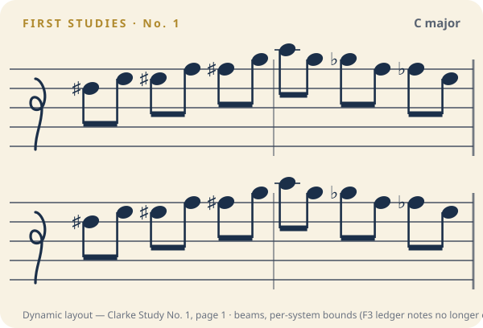
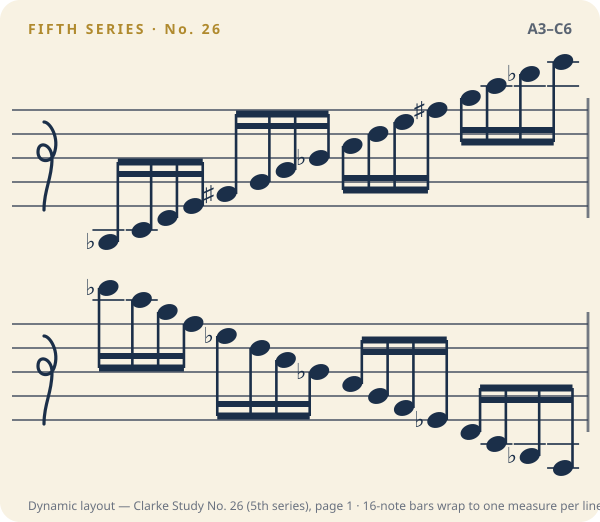

# Notation view — before / after snapshots

Visual record of the MusicXML notation component (`MusicXmlView`) used by the
**Practice** and **Record** screens, which parse the study's MusicXML from the
backend (`backend/studies/seed/musicxml/*.musicxml`, bundled for the app as
`apps/mobile/src/data/musicxmlCatalog.ts`).

At the time of these snapshots the notation was engraved **two measures per staff
line (system), two systems per page (four bars)** in a fixed-height frame; see
*Dynamic layout upgrade* below for the current width-and-bounds-driven layout.
Longer studies get `Prev` / `Next` page-flip controls. Rendered for **Clarke Study No. 1** (C major) — five measures,
so it spans two pages. These are the actual SVG the real component emits.

| Before — `MusicView` | After — `MusicXmlView`, page 1 (bars 1–4) |
| --- | --- |
|  |  |

Page 2 (bar 5), reached with the pager:

`notation-before-after.html` is a self-contained side-by-side comparison with the
pager controls and full notes.

## Style parity

The card chrome is unchanged from the original placeholder: `MusicXmlView` keeps
the same cream fill (`Radius.xl`, padding, shadow), header row, staff frame
(`viewBox="0 0 300 84"`, five lines in `#3A4658`, the decorative treble glyph,
the right barline), and note-glyph vocabulary (heads `rx 5.2 / ry 3.8` rotated
−20°, ink `#1B2F49`, gold `#C9A24A` slurs). Each system is that same staff, just
stacked — so the only differences are intended: real pitches/accidentals/flags/
ledger lines/bar lines, wrapped two-bars-per-line, with a page flipper.

Studies without scored notation fall back to the card's "notation unavailable" state.

## Dynamic layout upgrade (July 2026)

The engraving layout moved into a pure module (`apps/mobile/src/lib/musicxml/layout.ts`)
and three fixed-dimension assumptions were replaced (the snapshots above are kept as
the historical record of the fixed-viewBox era):

- **Per-system vertical bounds** — each staff line's SVG `viewBox` is computed from
  its own content (heads, ledger lines, stems, beams, accidentals, slur arcs), so
  ledger notes from E3 up to G6 render fully instead of clipping at the old fixed
  `0 0 300 84` frame. Plain mid-staff passages get a *tighter* box than before —
  no blanket padding.
- **Duration-aware spacing + adaptive packing** — notes get engraved widths by
  duration (plus accidental/dot clearance); measures pack 1–2 per line by width, so
  a 16-sixteenth bar takes a full line (~15px per note) instead of colliding at
  ~7.6px. Systems justify to the full line like typeset music.
- **Beams** — level-1 `<beam>` runs render as straight beams with a shared stem
  direction (secondary 16th beams derived from note type), replacing the
  flag-per-note clutter in fast passages.
- **Proportional sizing** — the SVG uses `aspectRatio` so notation scales uniformly
  with container width on any device (the old fixed 84px height letterboxed).

New snapshots, generated from the real layout module over the seed MusicXML:

| Clarke Study No. 1, page 1 (bass clef, beamed) | Clarke 5th-series No. 26, page 1 (A3–C6, 16-note bars) |
| --- | --- |
|  |  |

### Automated coverage

`apps/mobile/tests/musicxml.layout.test.ts` covers the edge cases (G6/E3 ledger
extremes, dense bars, accidental clearance, beam grouping/hooks, bass clef), and
`tests/musicxml.layout.corpus.test.ts` sweeps **all 132 bundled studies** asserting
no element leaves its viewBox and no adjacent notes collide.

### Manual on-device checks (no native build in the dev container)

- Practice → Clarke No. 1 (simple, bass clef): compact card, no extra whitespace.
- A 16th-note study (e.g. Fourth Study No. 1 / Fifth-series No. 26): one dense bar
  per line, beams instead of flags, readable spacing, pager present.
- Fifth-series No. 26 high/low systems: C6 ledger notes fully visible above the
  staff, A3 below — card grows only for those systems.
- Smallest supported phone (~320pt wide) and a large phone/tablet: notation scales
  proportionally, no side letterboxing, no horizontal scroll.
