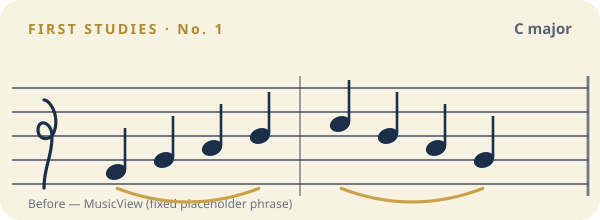
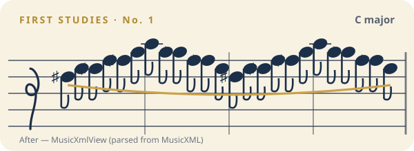
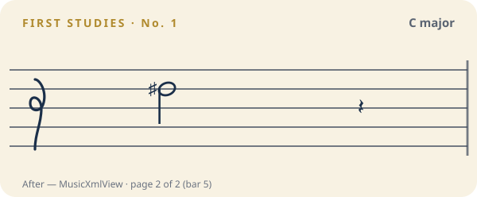

# Notation view — before / after snapshots

Visual record of the MusicXML notation component (`MusicXmlView`) used by the
**Practice** and **Record** screens, which parse the study's MusicXML from the
backend (`backend/studies/seed/musicxml/*.musicxml`, bundled for the app as
`apps/mobile/src/data/musicxmlCatalog.ts`).

The notation is engraved like real sheet music: **two measures per staff line
(system), two systems per page (four bars)**. Longer studies get `Prev` / `Next`
page-flip controls. Rendered for **Clarke Study No. 1** (C major) — five measures,
so it spans two pages. These are the actual SVG the real component emits.

| Before — `MusicView` | After — `MusicXmlView`, page 1 (bars 1–4) |
| --- | --- |
|  |  |

Page 2 (bar 5), reached with the pager:

`notation-before-after.html` is a self-contained side-by-side comparison with the
pager controls and full notes.

## Style parity

The card chrome is unchanged from the original placeholder: `MusicXmlView` keeps
the same cream fill (`Radius.xl`, padding, shadow), header row, staff frame
(`viewBox="0 0 300 84"`, five lines in `#3A4658`, the decorative treble glyph,
the right barline), and note-glyph vocabulary (heads `rx 5.2 / ry 3.8` rotated
−20°, ink `#1B2F49`, gold `#C9A24A` slurs). Each system is that same staff, just
stacked — so the only differences are intended: real pitches/accidentals/flags/
ledger lines/bar lines, wrapped two-bars-per-line, with a page flipper.

Studies without scored notation fall back to the card's "notation unavailable" state.
